# K-ECP SSO Development Guide

## Project Overview

K-ECP SSO is the centralized authentication system for K-ECP ecosystem services.

```mermaid
flowchart TB
    subgraph SSO["K-ECP SSO"]
        KC["🔐 Keycloak 24.0"]
        DB["🗄️ PostgreSQL 15"]
    end
    
    KC --> DB
    
    style SSO fill:#fff3e0,stroke:#f57c00
```



| Item | Value |
|------|-------|
| Purpose | OAuth2/OIDC authentication server |
| Tech Stack | Keycloak 24.0, PostgreSQL 15 |
| Container | Podman/Docker Compose |

## Repository Layout

```
kecp-sso/
├── compose.yml          # Development environment
├── compose.prod.yml     # Production environment
├── keycloak/
│   ├── import/          # Realm configuration (auto-import)
│   ├── themes/          # Custom login themes
│   └── certs/           # SSL certificates (production)
├── scripts/             # Utility scripts
└── docs/                # Integration guides
```

## Quick Start (Local Development)

```bash
# 1. Start services
podman-compose up -d

# 2. Wait for health check
./scripts/health-check.sh

# 3. Access Admin Console
open http://localhost:8180/admin
# admin / admin123
```

## Ports

| Service | Port | URL |
|---------|------|-----|
| Keycloak | 8180 | http://localhost:8180 |
| PostgreSQL | (internal) | - |

## Registered Clients


| Client ID | Service | Type |
|-----------|---------|------|
| k-ecp-main | user-console (Spring) | Confidential |
| k-ecp-marketplace | marketplace (Flask) | Confidential |
| k-ecp-support | KustHub (React SPA) | Public + PKCE |
| k-ecp-kohub | Kohub (React SPA) | Public + PKCE |

## Realm Roles

- `admin`: System administrator
- `operator`: Operations staff
- `partner`: Partner company
- `member`: Regular member

## Common Tasks

### Add new client


1. Keycloak Admin Console → Clients → Create
2. Update `keycloak/import/k-ecp-realm.json`
3. Document in `docs/client-integration.md`

### Backup realm
```bash
./scripts/backup-realm.sh
```

### Generate SSL certs (dev)
```bash
./scripts/generate-certs.sh
```

## Development Workflow


1. **Modify**: Edit realm JSON or compose files
2. **Test**: `podman-compose down && podman-compose up -d`
3. **Verify**: `./scripts/health-check.sh`
4. **Commit**: Git commit with descriptive message (한글 허용)
5. **Push**: `git push origin main`

## Coding Conventions

- Commit messages: 한글 허용
- Scripts: Bash with error handling (`set -e`)
- JSON: 2-space indent
- Diagrams: **Mermaid 사용**

## Integration

For client integration, see: [docs/client-integration.md](docs/client-integration.md)
