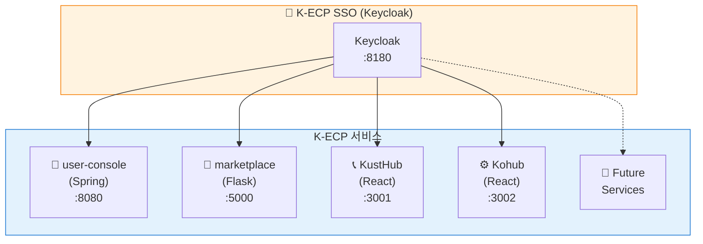
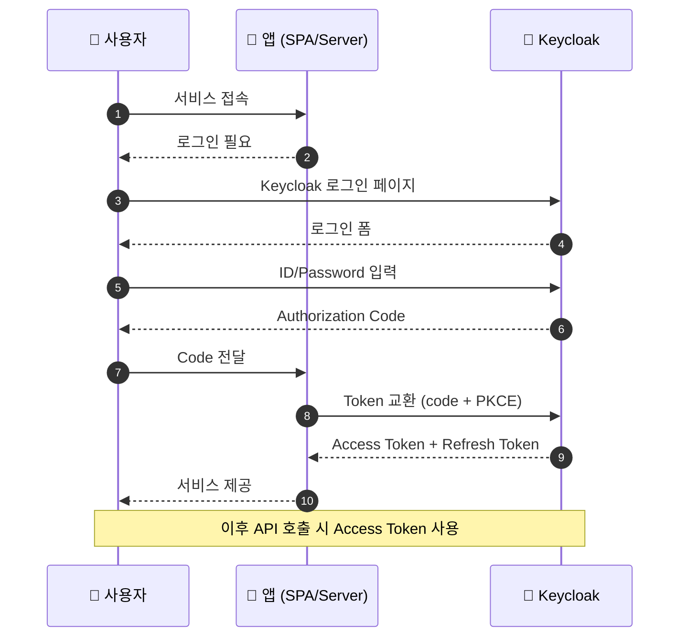
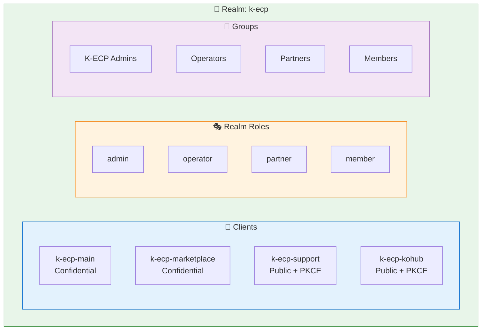
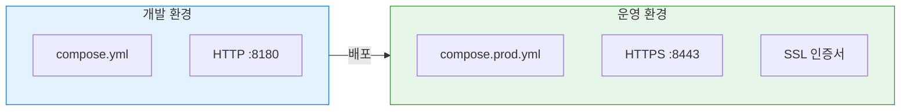

# K-ECP SSO

K-ECP 생태계 통합 인증 시스템 (Keycloak 기반)

## 개요

K-ECP 서비스들(user-console, marketplace, KustHub, Kohub)에서 단일 로그인(SSO)을 제공하는 인증 시스템입니다.



## 인증 흐름 (Authorization Code Flow + PKCE)



## 기술 스택

| 구성요소 | 기술 | 버전 |
|----------|------|------|
| 인증 서버 | Keycloak | 24.0 |
| 데이터베이스 | PostgreSQL | 15 |
| 컨테이너 | Podman/Docker Compose | - |

## 빠른 시작

### 1. 환경 변수 설정

```bash
cp .env.example .env
# .env 파일 편집
```

### 2. 서비스 시작

```bash
# 개발 환경
podman-compose up -d

# 또는 docker-compose
docker-compose up -d
```

### 3. 접속

- **Admin Console**: http://localhost:8180/admin
  - ID: admin / PW: admin123 (기본값)
- **k-ecp Realm**: http://localhost:8180/realms/k-ecp

### 4. 상태 확인

```bash
./scripts/health-check.sh
```

## Realm 구성



## 등록된 클라이언트

| Client ID | 서비스 | 유형 | 포트 |
|-----------|--------|------|------|
| k-ecp-main | user-console | Confidential | 8080 |
| k-ecp-marketplace | marketplace | Confidential | 5000 |
| k-ecp-support | KustHub | Public (PKCE) | 3001 |
| k-ecp-kohub | Kohub | Public (PKCE) | 3002 |

## Realm 역할

| 역할 | 설명 |
|------|------|
| admin | 시스템 관리자 |
| operator | 운영자 |
| partner | 파트너사 |
| member | 일반 회원 |

## 테스트 계정

| 이메일 | 비밀번호 | 역할 |
|--------|----------|------|
| testadmin@kecp.kdn.com | test1234 | admin |
| testuser@kecp.kdn.com | test1234 | member |

## 디렉토리 구조

```
kecp-sso/
├── compose.yml              # 개발 환경
├── compose.prod.yml         # 운영 환경
├── .env.example             # 환경 변수 템플릿
├── keycloak/
│   ├── import/
│   │   └── k-ecp-realm.json # Realm 초기 설정
│   ├── themes/kecp/         # 커스텀 테마 (옵션)
│   └── certs/               # SSL 인증서 (운영용)
├── scripts/
│   ├── generate-certs.sh    # 인증서 생성
│   ├── backup-realm.sh      # Realm 백업
│   └── health-check.sh      # 상태 확인
└── docs/
    └── client-integration.md # 클라이언트 연동 가이드
```

## 운영 환경 배포



```bash
# 1. SSL 인증서 준비
./scripts/generate-certs.sh  # 또는 공인 인증서 복사

# 2. 환경 변수 설정
cp .env.example .env
# 보안 비밀번호로 변경

# 3. 운영 모드로 시작
podman-compose -f compose.prod.yml up -d
```

## 연동 가이드

각 서비스에서 SSO를 연동하는 방법은 [클라이언트 연동 가이드](docs/client-integration.md)를 참조하세요.

## 문서

- [클라이언트 연동 가이드](docs/client-integration.md)
- [Keycloak 공식 문서](https://www.keycloak.org/documentation)

## License

Internal Use Only - K-ECP Team
