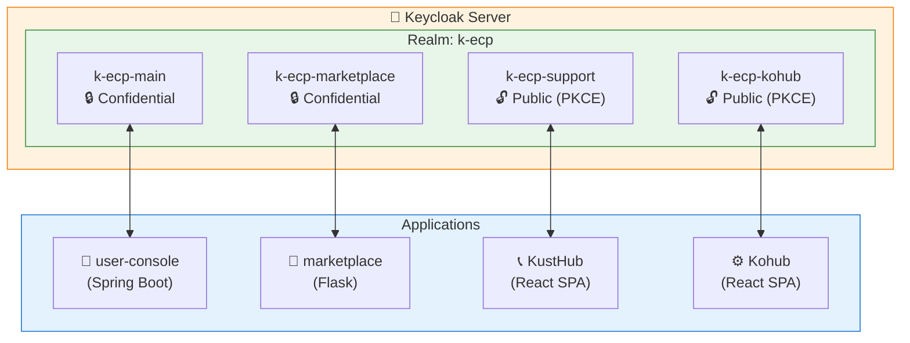
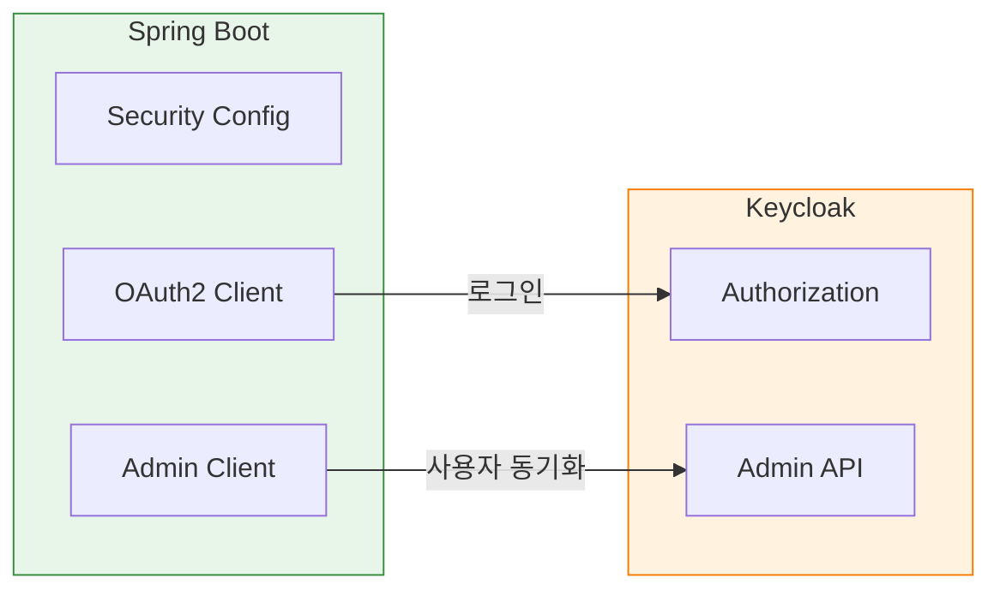
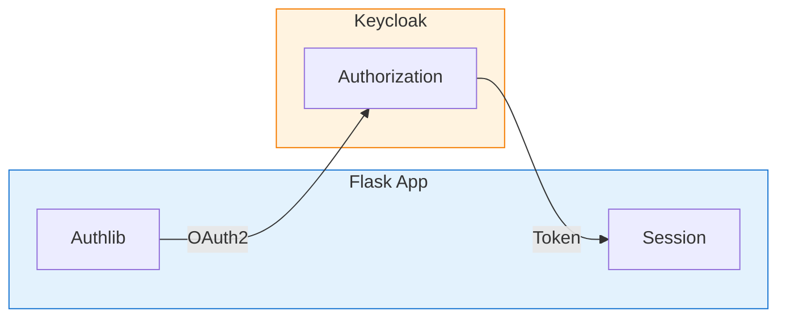
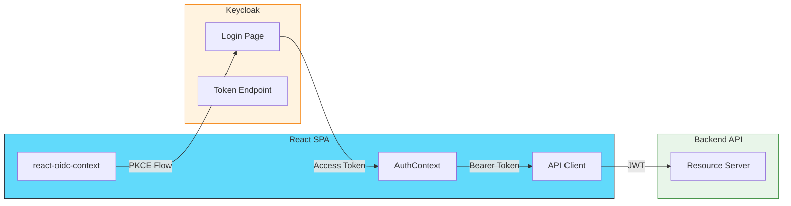
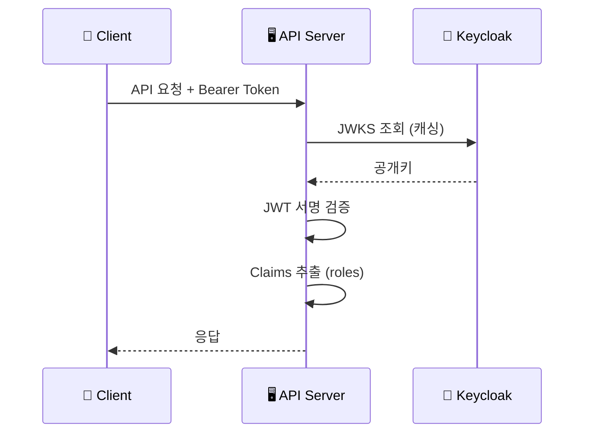
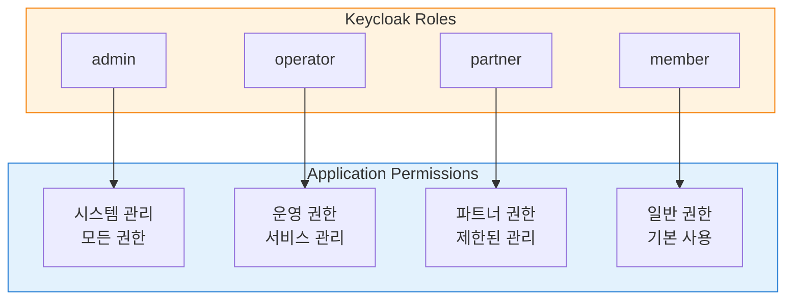
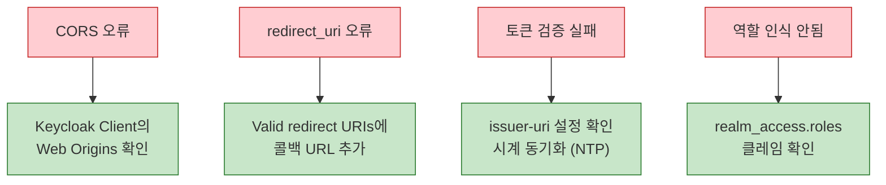

# K-ECP SSO 클라이언트 연동 가이드

K-ECP SSO(Keycloak)를 각 서비스에서 사용하기 위한 연동 가이드입니다.

## 개요



## 공통 정보

| 항목 | 개발 환경 | 운영 환경 |
|------|-----------|-----------|
| Keycloak URL | http://localhost:8180 | https://auth.kecp.kdn.com |
| Realm | k-ecp | k-ecp |
| OIDC Discovery | /realms/k-ecp/.well-known/openid-configuration | 동일 |

---

## 1. Spring Boot 연동 (user-console)

### 연동 구조



### 1.1 의존성 추가

```xml
<!-- pom.xml -->
<dependency>
    <groupId>org.springframework.boot</groupId>
    <artifactId>spring-boot-starter-oauth2-client</artifactId>
</dependency>
<dependency>
    <groupId>org.keycloak</groupId>
    <artifactId>keycloak-admin-client</artifactId>
    <version>24.0.0</version>
</dependency>
```

### 1.2 application.yml

```yaml
spring:
  security:
    oauth2:
      client:
        registration:
          keycloak:
            client-id: k-ecp-main
            client-secret: ${KEYCLOAK_CLIENT_SECRET}
            authorization-grant-type: authorization_code
            scope: openid, profile, email
        provider:
          keycloak:
            issuer-uri: ${KEYCLOAK_URL:http://localhost:8180}/realms/k-ecp
```

---

## 2. Flask 연동 (marketplace)

### 연동 구조



### 2.1 의존성

```
Authlib>=1.3.0
httpx>=0.27.0
```

### 2.2 설정

```python
# config.py
KEYCLOAK_URL = os.environ.get('KEYCLOAK_URL', 'http://localhost:8180')
KEYCLOAK_REALM = 'k-ecp'
KEYCLOAK_CLIENT_ID = 'k-ecp-marketplace'
KEYCLOAK_CLIENT_SECRET = os.environ.get('KEYCLOAK_CLIENT_SECRET', '')
OAUTH2_METADATA_URL = f"{KEYCLOAK_URL}/realms/{KEYCLOAK_REALM}/.well-known/openid-configuration"
```

### 2.3 OAuth 초기화

```python
from authlib.integrations.flask_client import OAuth

oauth = OAuth()
oauth.register(
    name='keycloak',
    client_id=app.config['KEYCLOAK_CLIENT_ID'],
    client_secret=app.config['KEYCLOAK_CLIENT_SECRET'],
    server_metadata_url=app.config['OAUTH2_METADATA_URL'],
    client_kwargs={'scope': 'openid email profile'}
)
```

---

## 3. React SPA 연동 (KustHub, Kohub)

### 연동 구조



### 3.1 의존성

```bash
npm install oidc-client-ts react-oidc-context
```

### 3.2 환경 변수

```bash
# .env
VITE_KEYCLOAK_URL=http://localhost:8180
VITE_KEYCLOAK_REALM=k-ecp
VITE_KEYCLOAK_CLIENT_ID=k-ecp-support  # 또는 k-ecp-kohub
```

### 3.3 OIDC Provider 설정

```javascript
// src/auth/oidcConfig.js
export const oidcConfig = {
  authority: `${import.meta.env.VITE_KEYCLOAK_URL}/realms/${import.meta.env.VITE_KEYCLOAK_REALM}`,
  client_id: import.meta.env.VITE_KEYCLOAK_CLIENT_ID,
  redirect_uri: `${window.location.origin}/callback`,
  post_logout_redirect_uri: window.location.origin,
  response_type: 'code',
  scope: 'openid profile email',
  automaticSilentRenew: true,
  loadUserInfo: true,
};
```

### 3.4 main.jsx

```javascript
import { AuthProvider } from 'react-oidc-context';
import { oidcConfig } from './auth/oidcConfig';

ReactDOM.createRoot(document.getElementById('root')).render(
  <AuthProvider {...oidcConfig}>
    <App />
  </AuthProvider>
);
```

---

## 4. Backend Resource Server (JWT 검증)

### JWT 검증 흐름



### 4.1 Spring Boot

```yaml
# application.yml
spring:
  security:
    oauth2:
      resourceserver:
        jwt:
          issuer-uri: ${KEYCLOAK_URL:http://localhost:8180}/realms/k-ecp
          jwk-set-uri: ${KEYCLOAK_URL:http://localhost:8180}/realms/k-ecp/protocol/openid-connect/certs
```

---

## 5. 역할(Role) 매핑



| Keycloak Role | 설명 | 대상 서비스 |
|---------------|------|-------------|
| admin | 시스템 관리자 | 모든 서비스 |
| operator | 운영자 | user-console, KustHub, Kohub |
| partner | 파트너사 | marketplace |
| member | 일반 회원 | 모든 서비스 |

---

## 6. 문제 해결

### 일반적인 오류와 해결 방법



### CORS 오류
- Keycloak Admin Console → Clients → Web Origins 확인

### redirect_uri 오류
- Valid redirect URIs에 정확한 콜백 URL 추가

### 토큰 검증 실패
- issuer-uri 설정 확인
- 시계 동기화 확인 (NTP)
