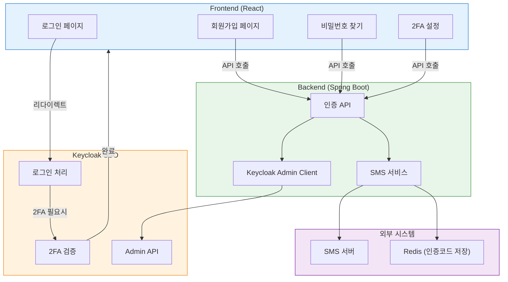
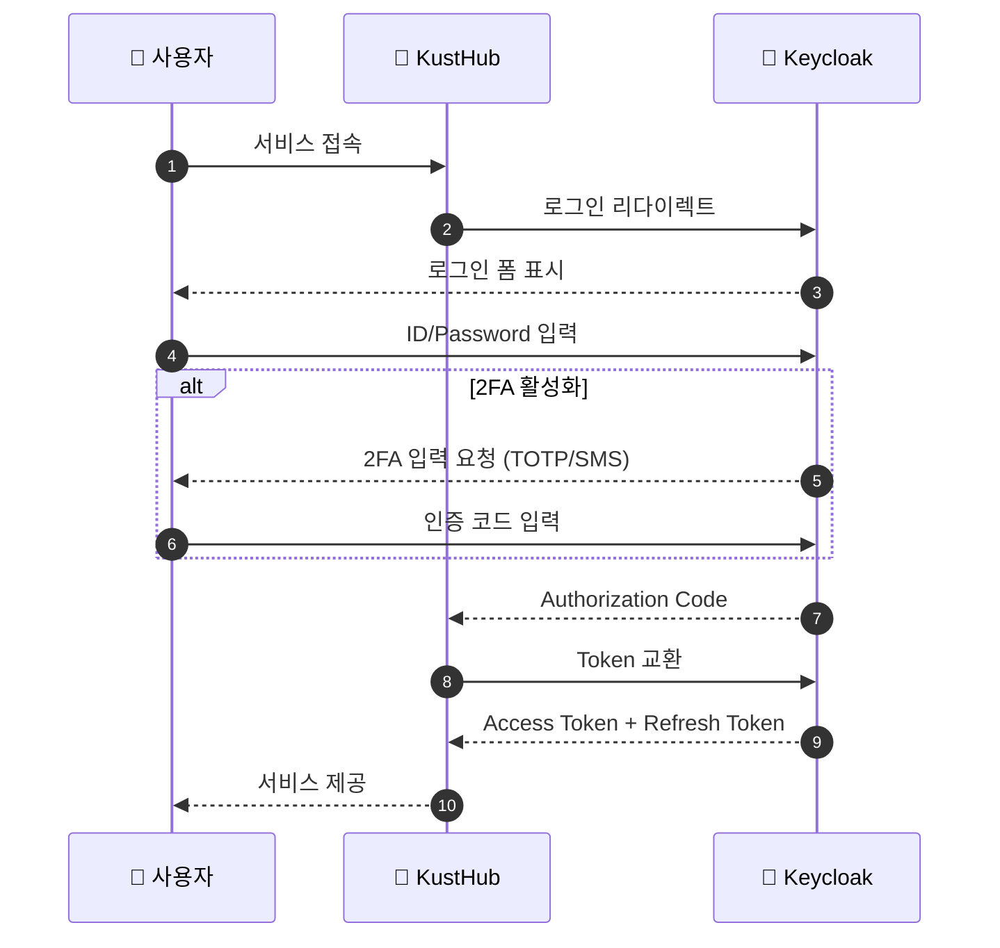
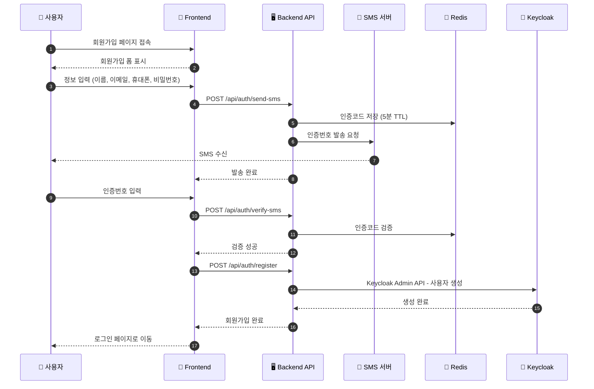
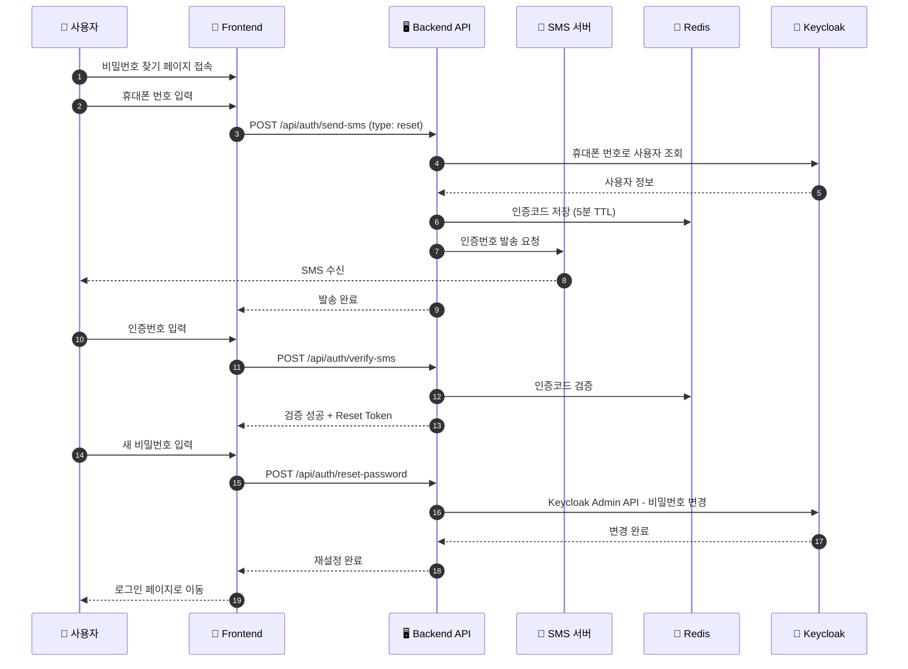
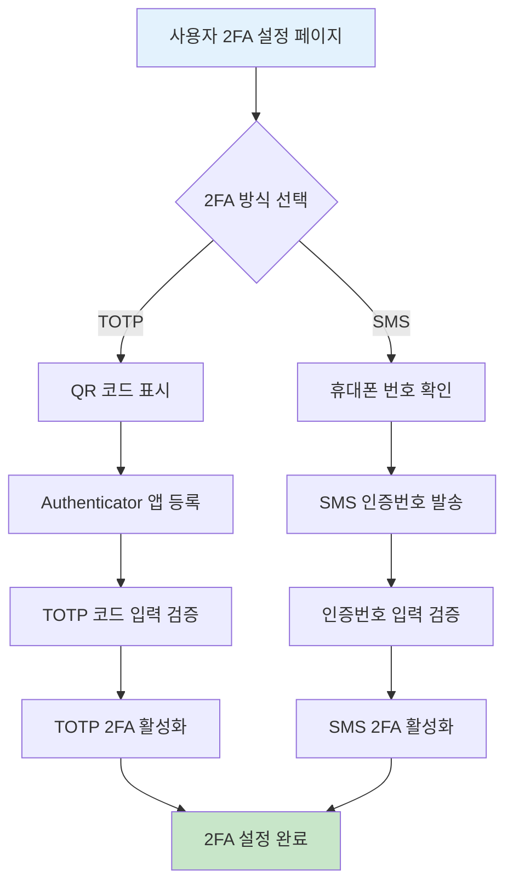
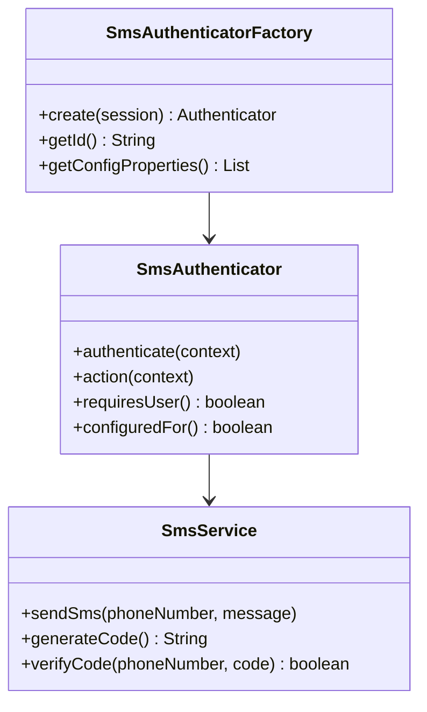
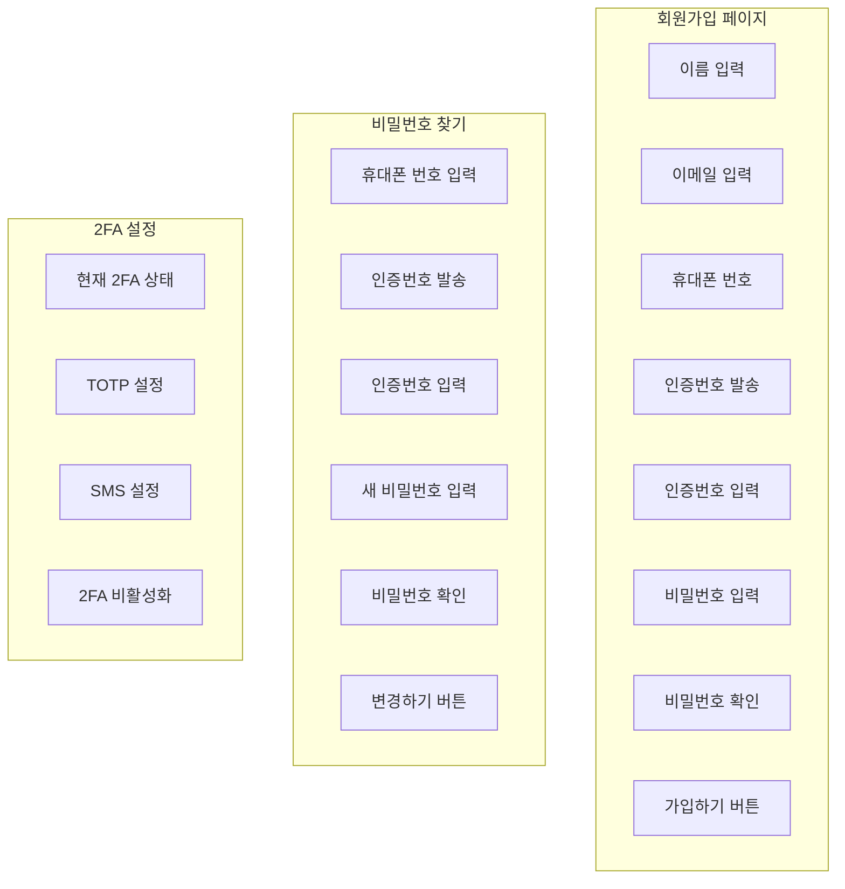
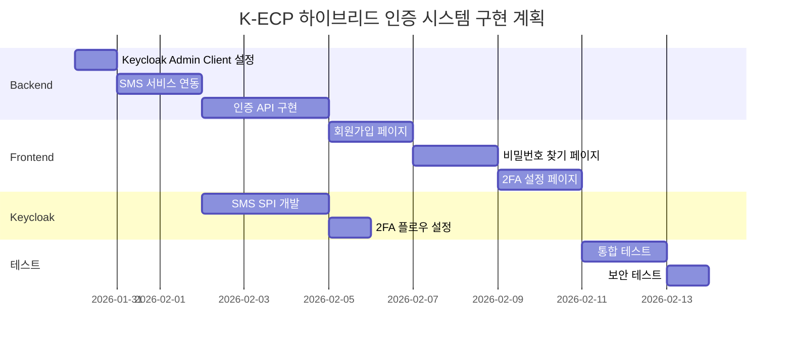

# K-ECP SSO 하이브리드 인증 시스템 설계

> 작성일: 2026-01-29  
> 버전: 1.0

## 1. 개요

K-ECP SSO 시스템에서 Keycloak의 테마 커스터마이징 한계를 극복하고, 더 유연한 사용자 경험을 제공하기 위한 하이브리드 인증 시스템 설계 문서입니다.

### 1.1 목표

- **로그인**: Keycloak 리다이렉트 방식 유지 (보안상 안전)
- **회원가입**: 커스텀 UI + Backend API + Keycloak Admin API
- **비밀번호 찾기**: 커스텀 UI + SMS 인증 + Keycloak Admin API
- **2FA**: TOTP와 SMS 중 사용자 선택 가능

### 1.2 대상 서비스

| 서비스 | Client ID | 설명 |
|--------|-----------|------|
| KustHub | k-ecp-support | 고객센터 (React SPA) |
| Kohub | k-ecp-kohub | 운영 플랫폼 (React SPA) |
| user-console | k-ecp-main | 메인 포털 (Spring Boot) |
| marketplace | k-ecp-marketplace | 마켓플레이스 (Flask) |

---

## 2. 전체 아키텍처



---

## 3. 인증 플로우

### 3.1 로그인 플로우

Keycloak 리다이렉트 방식을 유지하여 보안을 확보합니다.



### 3.2 회원가입 플로우

커스텀 UI와 Backend API를 통해 회원가입을 처리합니다.



### 3.3 비밀번호 찾기 플로우

SMS 인증을 통해 비밀번호를 재설정합니다.



---

## 4. 2FA (Two-Factor Authentication)

### 4.1 지원 방식

| 방식 | 설명 | 구현 |
|------|------|------|
| **TOTP** | Google/Microsoft Authenticator 앱 | Keycloak 내장 |
| **SMS** | 문자 메시지로 인증 코드 | Keycloak SPI + SMS 서버 |

### 4.2 2FA 설정 플로우



### 4.3 Keycloak SMS SPI 구현

SMS 2FA를 위해 Keycloak SPI (Service Provider Interface)를 구현합니다.



---

## 5. Backend API 설계

### 5.1 API 엔드포인트

| Method | Endpoint | 설명 |
|--------|----------|------|
| POST | `/api/auth/register` | 회원가입 |
| POST | `/api/auth/send-sms` | SMS 인증번호 발송 |
| POST | `/api/auth/verify-sms` | SMS 인증번호 검증 |
| POST | `/api/auth/reset-password` | 비밀번호 재설정 |
| GET | `/api/auth/2fa/status` | 2FA 설정 상태 조회 |
| POST | `/api/auth/2fa/totp/setup` | TOTP 설정 |
| POST | `/api/auth/2fa/sms/setup` | SMS 2FA 설정 |
| DELETE | `/api/auth/2fa/disable` | 2FA 비활성화 |

### 5.2 API 상세 스펙

#### 5.2.1 회원가입

```
POST /api/auth/register
Content-Type: application/json

Request:
{
  "email": "user@example.com",
  "name": "홍길동",
  "phoneNumber": "010-1234-5678",
  "password": "SecurePassword123!",
  "smsVerificationToken": "abc123..."
}

Response (201 Created):
{
  "success": true,
  "message": "회원가입이 완료되었습니다.",
  "userId": "uuid-1234-5678"
}

Response (400 Bad Request):
{
  "success": false,
  "error": "DUPLICATE_EMAIL",
  "message": "이미 등록된 이메일입니다."
}
```

#### 5.2.2 SMS 인증번호 발송

```
POST /api/auth/send-sms
Content-Type: application/json

Request:
{
  "phoneNumber": "010-1234-5678",
  "type": "register" | "reset" | "2fa"
}

Response (200 OK):
{
  "success": true,
  "message": "인증번호가 발송되었습니다.",
  "expiresIn": 300
}
```

#### 5.2.3 SMS 인증번호 검증

```
POST /api/auth/verify-sms
Content-Type: application/json

Request:
{
  "phoneNumber": "010-1234-5678",
  "code": "123456"
}

Response (200 OK):
{
  "success": true,
  "verificationToken": "jwt-token-for-next-step"
}

Response (400 Bad Request):
{
  "success": false,
  "error": "INVALID_CODE",
  "message": "인증번호가 올바르지 않습니다."
}
```

#### 5.2.4 비밀번호 재설정

```
POST /api/auth/reset-password
Content-Type: application/json

Request:
{
  "verificationToken": "jwt-token",
  "newPassword": "NewSecurePassword123!"
}

Response (200 OK):
{
  "success": true,
  "message": "비밀번호가 변경되었습니다."
}
```

---

## 6. Frontend 페이지

### 6.1 페이지 구조

```
/auth
├── /login          → Keycloak 리다이렉트
├── /register       → 커스텀 회원가입
├── /forgot-password → 커스텀 비밀번호 찾기
├── /callback       → Keycloak 콜백
└── /settings
    └── /2fa        → 2FA 설정
```

### 6.2 UI 컴포넌트



---

## 7. 데이터 모델

### 7.1 Redis 저장 구조

```
# SMS 인증코드
sms:verify:{phoneNumber} = {
  code: "123456",
  type: "register|reset|2fa",
  attempts: 0,
  createdAt: timestamp
}
TTL: 300초 (5분)

# 인증 완료 토큰
sms:token:{phoneNumber} = {
  token: "jwt-token",
  type: "register|reset",
  userId: "uuid" (비밀번호 찾기 시)
}
TTL: 600초 (10분)
```

### 7.2 Keycloak 사용자 속성

| 속성 | 설명 |
|------|------|
| `phoneNumber` | 휴대폰 번호 |
| `phoneVerified` | 휴대폰 인증 여부 |
| `twoFactorMethod` | 2FA 방식 (totp/sms/none) |

---

## 8. 보안 고려사항

### 8.1 SMS 인증 보안

| 항목 | 대책 |
|------|------|
| 브루트포스 방지 | 5회 실패 시 30분 차단 |
| 재발송 제한 | 60초 간격 제한 |
| 인증코드 유효시간 | 5분 |
| 인증코드 길이 | 6자리 숫자 |

### 8.2 비밀번호 정책

| 항목 | 요구사항 |
|------|----------|
| 최소 길이 | 8자 이상 |
| 복잡성 | 영문, 숫자, 특수문자 포함 |
| 이전 비밀번호 | 최근 3개 재사용 불가 |

### 8.3 토큰 보안

- SMS 검증 토큰: JWT, 10분 유효
- 단일 사용: 사용 후 즉시 무효화

---

## 9. 구현 순서



---

## 10. 참고 자료

- [Keycloak Admin REST API](https://www.keycloak.org/docs-api/24.0/rest-api/)
- [Keycloak SPI 개발 가이드](https://www.keycloak.org/docs/latest/server_development/)
- [OIDC Authorization Code Flow](https://openid.net/specs/openid-connect-core-1_0.html)

---

## Appendix A: SMS 서버 연동 스펙

SMS 서버 API 스펙은 기존 시스템의 문서를 참조하여 별도 작성 예정.

```
# 예상 인터페이스
POST /sms/send
{
  "phoneNumber": "010-1234-5678",
  "message": "[K-ECP] 인증번호: 123456"
}
```

---

## Appendix B: 환경 변수

```bash
# Backend
KEYCLOAK_URL=http://localhost:8180
KEYCLOAK_REALM=k-ecp
KEYCLOAK_CLIENT_ID=k-ecp-admin
KEYCLOAK_CLIENT_SECRET=your-secret

# SMS Server
SMS_SERVER_URL=https://sms.example.com
SMS_API_KEY=your-api-key

# Redis
REDIS_HOST=localhost
REDIS_PORT=6379
```
